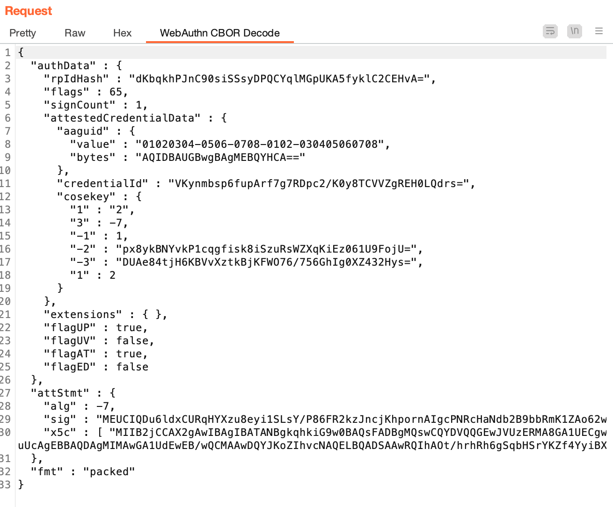

# WebAuthn CBOR Burp
WebAuthn CBOR is a Burp Extension to decode WebAuthn CBOR format. [WebAuthn](https://www.w3.org/TR/webauthn-2/) is a W3C Standard to support strong authentication of users. WebAuthn depends on several other specifications such as Base64url encoding, Concise Binary Object Representation (CBOR), CBOR Object Signing and Encryption (COSE) to name a few. For more details, refer [3. Dependencies](https://www.w3.org/TR/webauthn-2/#sctn-dependencies). This Burp extension enables to view the decoded [CBOR format](https://www.rfc-editor.org/info/rfc8949).

# Installation
1. Clone or download this repo.
2. Compile the code: `gradle bigJar`. The compiled jar location is `build/libs/webauthn-cbor-burp-all-1.0.jar`
3. [Follow the instructions](https://portswigger.net/burp/documentation/desktop/tools/extender#installing-an-extension-from-a-file) to load the jar.

## Environment Requirements
This extension was developed and tested with the following setup:
1. JDK 11
2. Gradle 7.4.2

# Usage
* Intercept the WebAuthn request/response using Burp proxy
* If the request has a `attestationObject` parameter, a new Tab `WebAuthn CBOR Decode` will be added and the decoded CBOR format will be dispalyed. See **Screenshot** section below.

## Testing
* https://webauthn.io/ has a demo application to illustrate WebAuthn request/response.
* Chrome has WebAuthn authenticator emulator - https://developer.chrome.com/docs/devtools/webauthn/ 

## Screenshot

## References
* https://fidoalliance.org/fido2-2/fido2-web-authentication-webauthn/
* https://webauthn.guide/
* https://webauthn.io/
* https://cbor.io/
* https://portswigger.net/burp/documentation/desktop/tools/extender